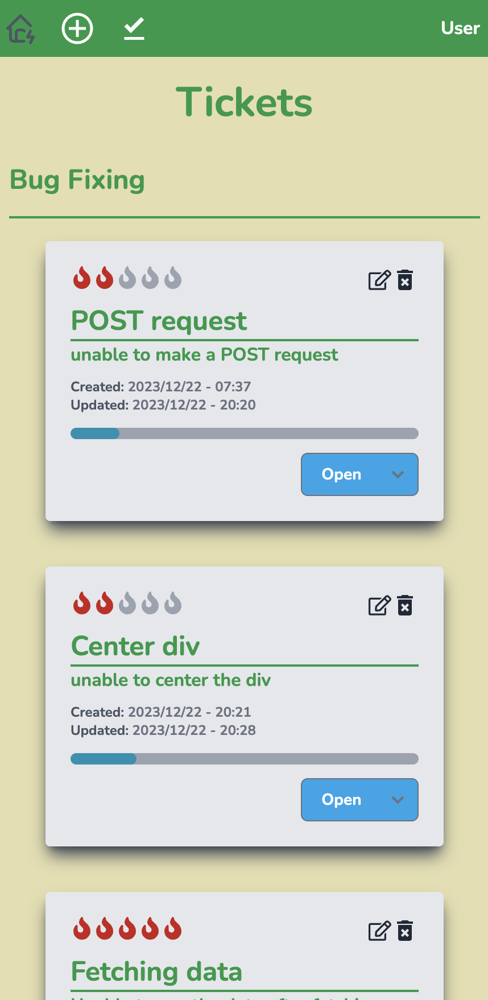
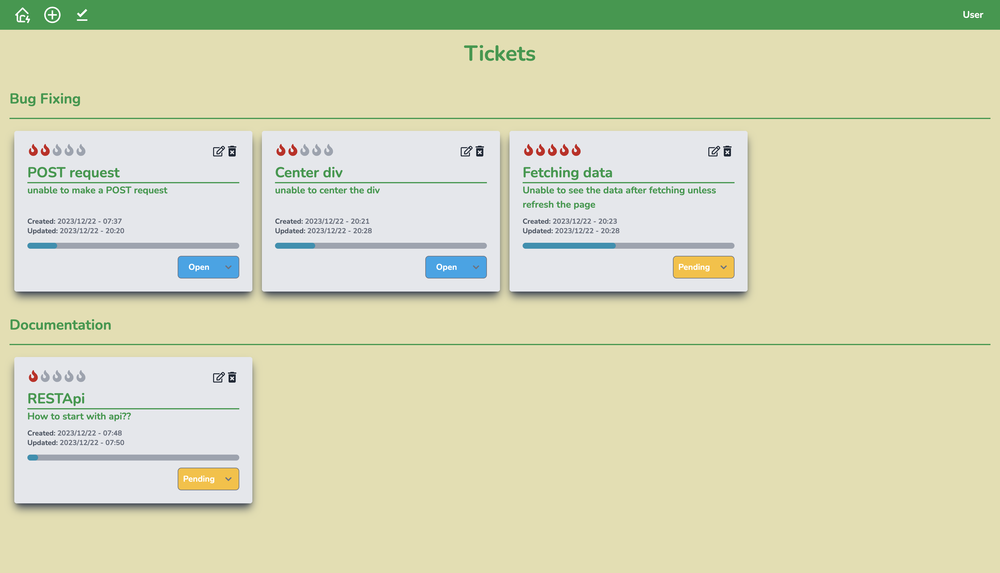
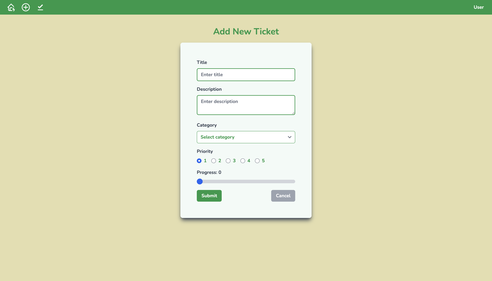
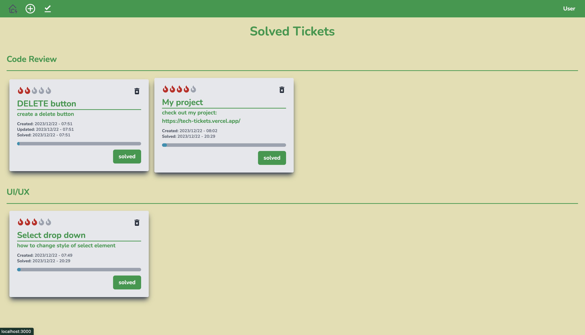

# Teck Tickets App

**[LIVE DEMO](https://tech-tickets.vercel.app/)**

 

# Description

The Teck Tickets app is a website designed to facilitate the creation, display, editing, and deletion of tickets through the implementation of CRUD (Create, Read, Update, Delete) operations. Additionally, when a ticket is resolved, it will be moved to a separate section known as the "solved" page, where solved tickets are stored in a distinct table. This functionality is achieved by utilizing React for the frontend and a NoSQL MongoDB database for the backend.

 

# Tools

- JavaScript
- TypeScript
- React
- NextJs
- Tailwind CSS
- MongoDB - Mongoose

 

# packages

- Flowbite
- React-icons

 

# Developer

**Gorgees Odisho**

- [LinkedIn](https://www.linkedin.com/in/gorgees/)

 

---

    
    
    
    

